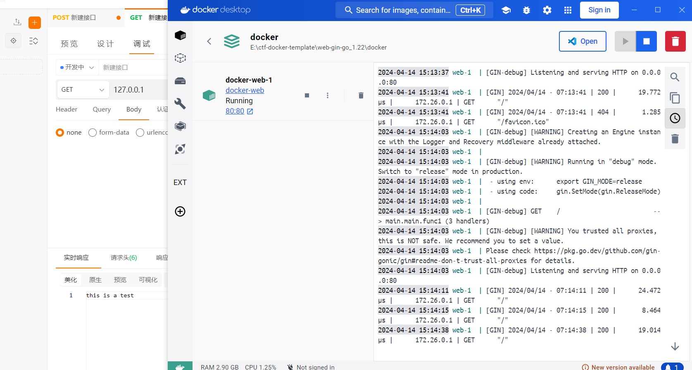

# Web-gin-go_1.22


## 环境说明

    提供`go 1.22`的基础环境, 其他相关依赖需要在自己的`go.mod`中声明
    
    默认暴露端口为80
    
    为了防止非预期，在dockerfile中有`RUN echo $GZCTF_FLAG > /home/ch3/app/fake_flag_path`，在指定的路径下生成`flag`

## 如何使用

需要将`gin`项目文件放置于`./src`中

- 编译镜像

在Dockerfile目录下执行`docker build .`


- 一键启动测试容器

```
cd ./docker
docker-compose up -d
```


## 测试

